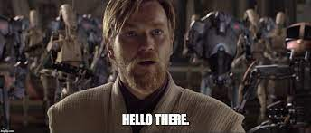

# ¡Hola!

## Sobre mí

:wave: Me Llamo **Ian Cortez**.  
:books: Estudiante de **CS** en **UTEC**.  
:open_file_folder: Actualmente, en el 4to ciclo de la carrera.  

## Intereses

* Videojuegos, mayormente juegos de peleas como Street Fighter :fist_right: o cooperativos como Dead by Daylight :skull_and_crossbones:.
* Ver series y películas. Además de animes y mangas.
* Escuchar [música](https://youtu.be/dQw4w9WgXcQ), y tocar guitarra.
* Aprender más sobre desarrollo web y desarrollo de videojuegos.

## Mis lenguajes de programación
Los lenguajes que uso ordenados del más preferido al menos preferido.
1. C++
2. Golang
3. Java
4. Python
5. Javascript (conceptos básicos)

